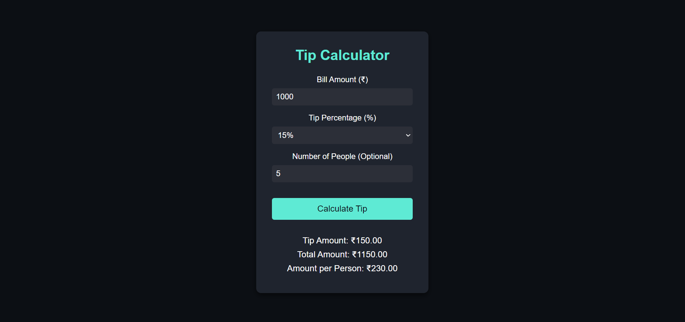

# Day 4: Tip Calculator 💸

## Project Overview

The **Tip Calculator** helps users quickly calculate the tip amount, total bill, and how much each person owes if splitting the bill. It's a simple yet practical tool for mastering basic JavaScript functions like math operations, input validation, and DOM manipulation.

## Features

- Calculate tip based on the bill amount and tip percentage.
- Calculate total bill including tip.
- Optional: Split the total amount between multiple people.

## Demo

Check out the live demo [here](https://30dayjs-vaibhavkatariya.vercel.app/Day-04).

