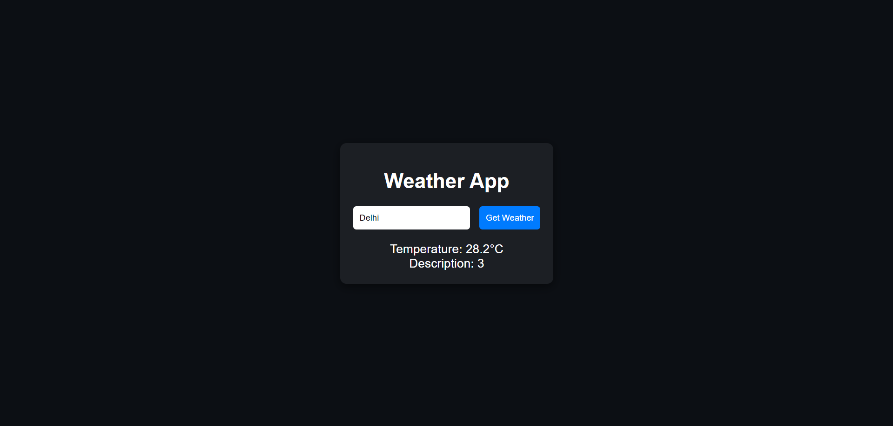

# Day 6: Weather App 🌦️

## Project Overview

Today's project is a simple **Weather App** that fetches current weather data for Delhi using a public API. This app demonstrates the use of the Fetch API to retrieve data and display it on a webpage.

## Important Note

The input field is not used in this version of the app. The coordinates are hardcoded to Delhi, India (latitude: 28.6139, longitude: 77.2090). You can modify the coordinates directly in the JavaScript file to get weather data for other locations.

## Features

- Input field to enter a city name (not utilized).
- Fetches current weather data without requiring an API key.
- Displays temperature and weather description.

## How to Use

1. Click the "Get Weather" button to fetch the current weather.
2. The temperature and weather description for Delhi will be displayed below

## Demo

Check out the live demo [here](https://30dayjs-vaibhavkatariya.vercel.app/Day-06).

