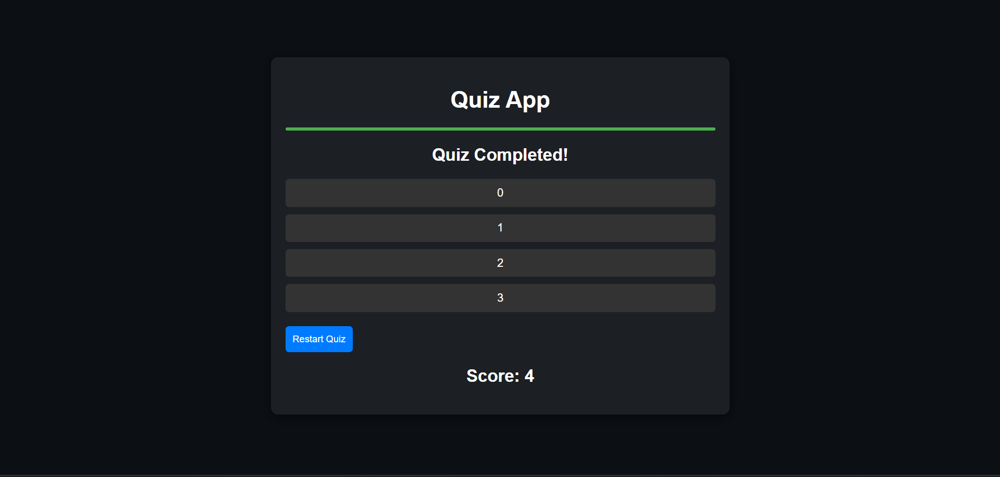

# Day 8: Quiz App 🎓

## Project Overview

Today's project is a **Quiz App** that challenges users with multiple-choice questions, keeps track of their score, and provides feedback on their progress. This app involves handling more complex state management and logic, making it a great step up from previous projects.

## Features

- **Multiple Questions and Answers:** Display a set of questions with multiple-choice answers.
- **Score Tracking:** Keep track of the score as the user answers questions.
- **Feedback on Answers:** Provides immediate feedback on the correctness of answers.
- **Restart Quiz Option:** Allows the user to restart the quiz and try again.
- **Progress Bar:** Displays the progress of the quiz visually.

## How to Use

1. Read the question and select an answer.
2. Click "Next" to go to the next question.
3. The score will be updated as you answer questions correctly.
4. Click "Restart Quiz" to start over when finished.

## Demo

Check out the live demo [here](https://30dayjs-vaibhavkatariya.vercel.app/Day-08).

