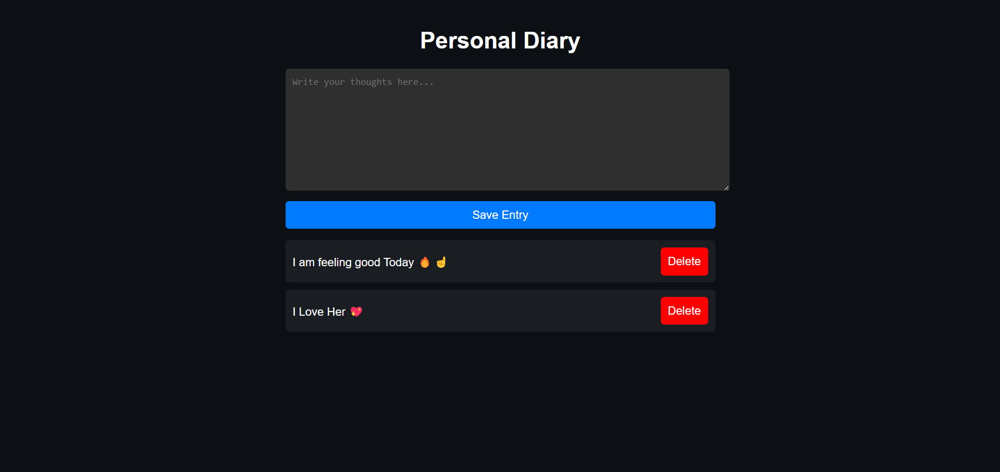

# Personal Diary App 📖

## Project Overview

The Personal Diary App allows users to write and save their thoughts in a diary format. Users can add, view and delete diary entries. 

## Features

- Add Diary Entry
- View Diary Entries
- Delete Diary Entries

## How to Use

1. Write your thoughts in the text area.
2. Click the "Save Entry" button to add your diary entry.
3. Your entries will appear below.
4. Click the "Delete" button next to any entry to remove it.

## Demo

Check out the live demo [here](https://30dayjs-vaibhavkatariya.vercel.app/Day-09).

