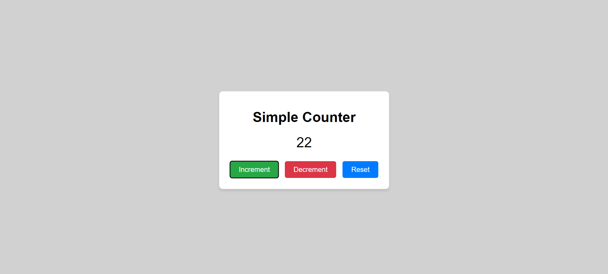

# Day 1: Simple Counter App

## Project Overview

Today’s project is a **Simple Counter App**. The goal of this project is to create a basic counter that allows users to increment, decrement, and reset a number. This app helps in understanding DOM manipulation, event listeners, and basic JavaScript functions.

## Demo
