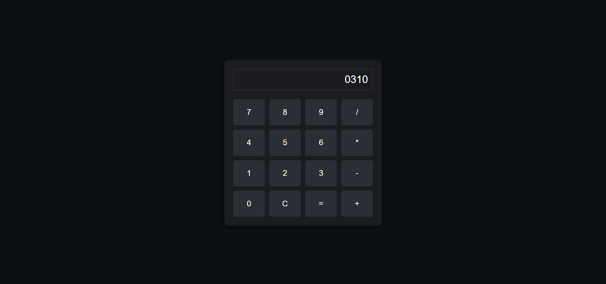

# Day 10: Basic Calculator 📱

## Project Overview
Today’s project is a **Basic Calculator** that supports basic arithmetic operations like addition, subtraction, multiplication, and division. It also supports keyboard input for a more user-friendly experience.

## Features
- Supports operations: Addition (+), Subtraction (-), Multiplication (*), and Division (/).
- Works with both button clicks and keyboard inputs.
- Includes 'Clear' button (C) to reset the calculator.

## Demo
Check out the demo [here](https://30dayjs-vaibhavkatariya.vercel.app/Day-10).

