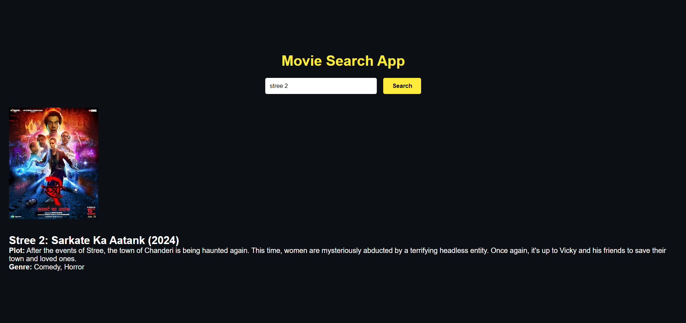

# Day 11: Movie Search App 🎬

## Project Overview

Today’s project is a **Movie Search App**. This app allows users to search for any movie by title and view details like the title, year, poster, and plot. The OMDb API is used to fetch the movie information. This project helps in understanding how to work with external APIs and dynamically updating the DOM with user-provided data.

## How It Works
- Enter a movie title in the input field and click the "Search" button.
- The app fetches the movie details from the OMDb API and displays them below the search bar.
- If no movie is found, an error message is shown.

## Key Learnings
- Using fetch to get data from an external API.
- Handling asynchronous operations with async/await.
- Dynamically updating the DOM.

## Demo
Check out the demo [here](https://30dayjs-vaibhavkatariya.vercel.app/Day-11).
