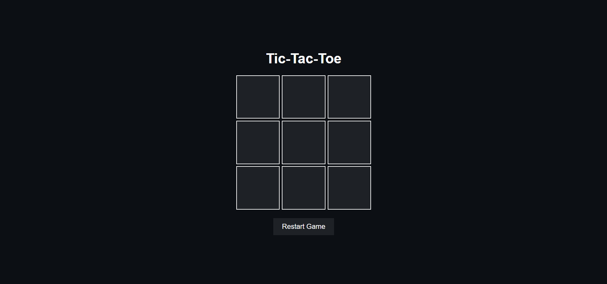

# Day 12: Tic-Tac-Toe Game ➕

## Project Overview
This project is a **Tic-Tac-Toe** game where two players take turns marking the spaces in a 3×3 grid. The player who succeeds in placing three of their marks in a horizontal, vertical, or diagonal row wins the game.

## Features:
- Two-player game (X and O).
- Detects win or draw.
- Allows restarting the game.

## How to Play:
- Click on the cells to place your mark (X or O).
- The game will check for a win or a draw.
- You can restart the game by clicking the "Restart Game" button.

## Demo
Check out the demo [here](https://30dayjs-vaibhavkatariya.vercel.app/Day-12).
