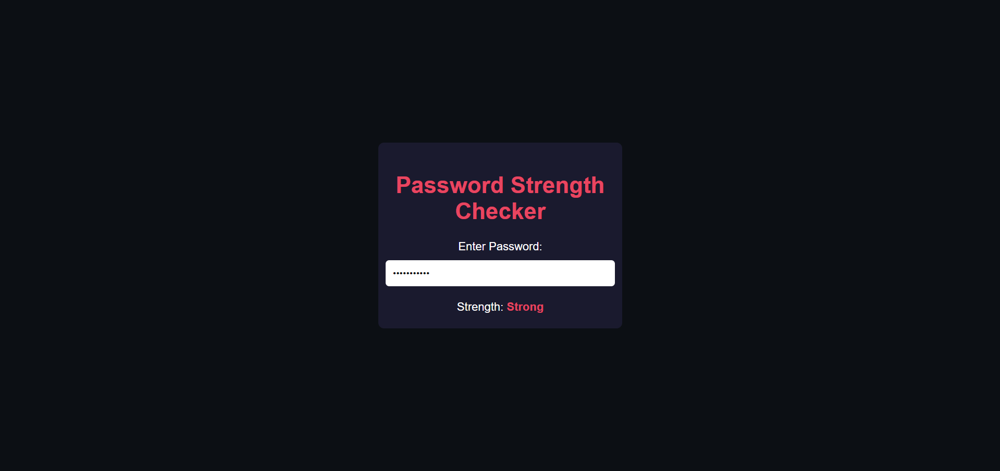

# Day 13: Password Strength Checker 🔑

## Project Overview

Today's project is a **Password Strength Checker**. The app evaluates the strength of a password entered by a user. The strength is determined based on various criteria such as length, inclusion of uppercase letters, numbers, and special characters.

## Features
- Password input field
- Real-time password strength checking
- Strength level: Weak, Medium, or Strong

## How It Works
- If the password length is more than 8 and contains uppercase letters, numbers, and special characters, the strength is considered **Strong**.
- If the password length is at least 6 and contains either uppercase letters, numbers, or special characters, the strength is **Medium**.
- Otherwise, the password strength is marked as **Weak**.

## Demo
Check out the demo [here](https://30dayjs-vaibhavkatariya.vercel.app/Day-13).
