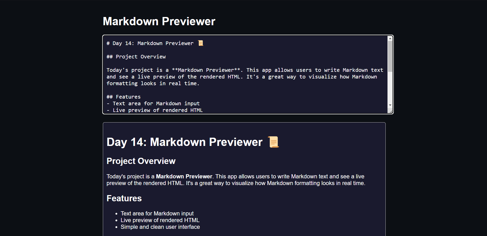

# Day 14: Markdown Previewer 📜

## Project Overview

Today's project is a **Markdown Previewer**. This app allows users to write Markdown text and see a live preview of the rendered HTML. It's a great way to visualize how Markdown formatting looks in real time.

## Features
- Text area for Markdown input
- Live preview of rendered HTML
- Simple and clean user interface

## How It Works
- The app uses the **marked.js** library to convert Markdown text into HTML.
- As users type in the text area, the preview updates automatically to reflect the changes in Markdown formatting.

## Demo
Check out the demo [here](https://30dayjs-vaibhavkatariya.vercel.app/Day-14).

