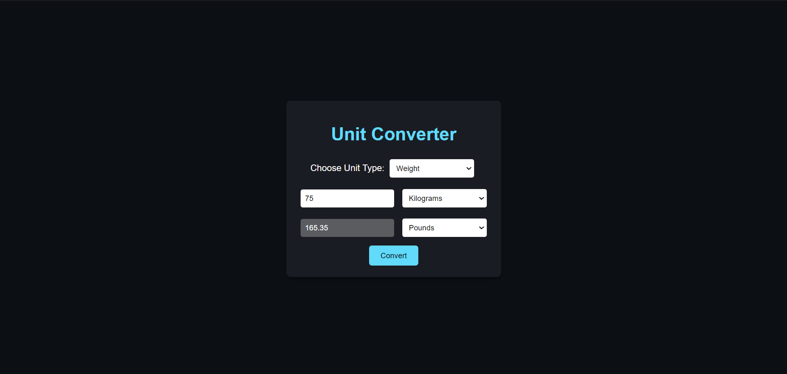

# Day 15: Unit Converter App 🔄

## Project Overview

Today's project is a **Unit Converter App**. The app allows users to convert between different units such as length, weight, and temperature.

## Features
- Select unit type (Length, Weight, Temperature)
- Convert between different units (e.g., meters to kilometers, Celsius to Fahrenheit)
- Real-time conversion

## How It Works
- Users input a value and select the units they want to convert from and to.
- The app converts the value and displays the result in real-time

## Demo
Check out the demo [here](https://30dayjs-vaibhavkatariya.vercel.app/Day-15).

