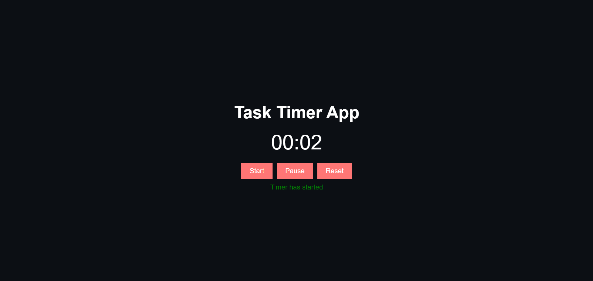

# Day 16: Task Timer App ⏱️

## Project Overview
Today's project is a **Task Timer App**. It allows you to track time for tasks with the ability to start, pause, and reset the timer.

## Features
- **Start** the timer
- **Pause** the timer
- **Reset** the timer to 0:00

## How It Works
- The timer increments seconds and minutes.
- You can pause the timer and resume it.
- Resetting the timer will set the values back to 0:00.

## Demo
Check out the demo [here](https://30dayjs-vaibhavkatariya.vercel.app/Day-16).

