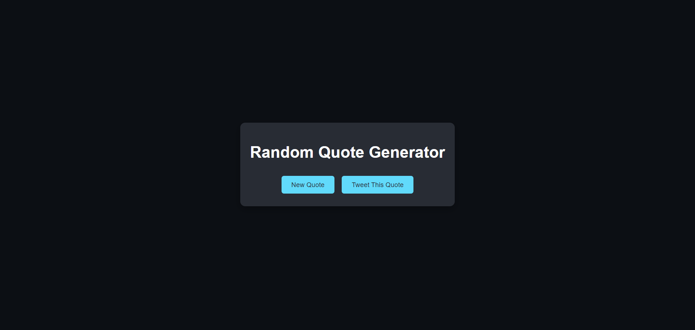

# Day 18: Random Quote Generator 📝

## Project Overview
A simple app that generates a random quote each time the user clicks a button. Users can also tweet the quote directly.

## Features
- Fetches random quotes from an API
- Option to tweet the displayed quote
- Changes background color with each new quote

## How It Works
- When the "New Quote" button is clicked, a random quote is fetched from the Quotes API and displayed.
- The "Tweet This Quote" button allows the user to tweet the current quote.

## Demo
Check out the demo [here](https://30dayjs-vaibhavkatariya.vercel.app/Day-18).

