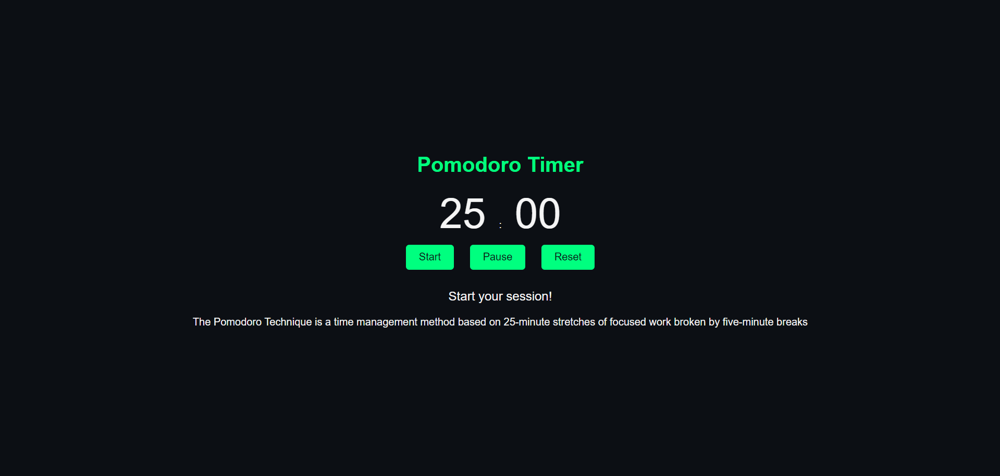

# Day 19: Pomodoro Timer ⏲️

## Project Overview
Today's project is a **Pomodoro Timer** app, which helps you manage work and break sessions using the Pomodoro technique. The app runs a 25-minute work session followed by a 5-minute break, repeating this cycle.

## Features
- 25-minute work session followed by a 5-minute break.
- Timer auto-resets between work and break periods.
- Notifications for starting work and break sessions.
- Start, pause, and reset functionality.

## How It Works
- Press **Start** to begin the timer.
- The app will switch between a 25-minute work session and a 5-minute break session.
- You can **Pause** or **Reset** the timer anytime.

## Demo
Check out the demo [here](https://30dayjs-vaibhavkatariya.vercel.app/Day-19).

