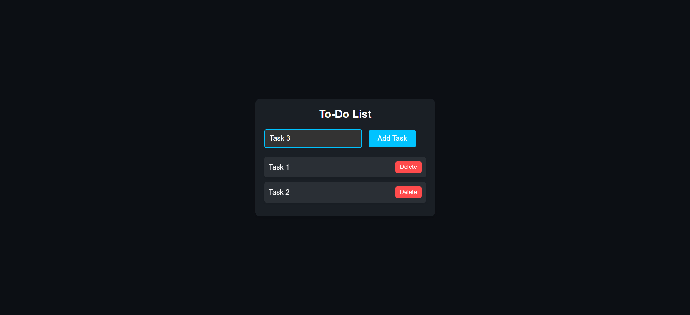

# To-Do List App 📝

A simple and intuitive To-Do List App that allows users to add, delete, and manage their tasks. This app saves tasks in `localStorage`, so they persist even after refreshing the page.

## Features
- **Add a To-Do**: Users can add new tasks to the list.
- **Delete a To-Do**: Users can delete tasks from the list.
- **Persistent Storage**: Tasks are saved in `localStorage` and persist across page reloads.
- **No Tasks Message**: Displays a "No todos added yet" message when there are no tasks in the list.

## How to Use
1. Type your task into the input field.
2. Click the "Add" button or press "Enter" to add the task to the list.
3. To delete a task, click the "Delete" button next to the task.

## Demo
You can check out the demo of the app [here](https://30dayjs-vaibhavkatariya.vercel.app/Day-2).

