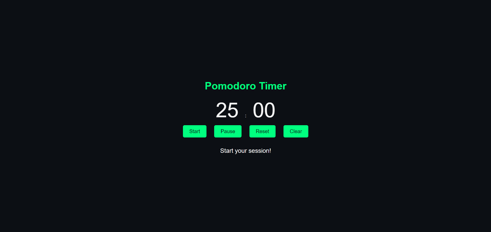

# Day 20: Advance Pomodoro Timer ⏲️ 

## Project Overview
Today's project is an **Advance Pomodoro Timer** app, which builds upon the original [Pomodoro Timer](https://30dayjs-vaibhavkatariya.vercel.app/Day-19) from [Day 19](https://github.com/VaibhavKatariya/30DaysOfJavaScript/tree/main/Day-19). This app helps you manage work and break sessions using the Pomodoro technique, allowing users to set custom focus and break times and supporting looping through sessions.

## Features
- Customizable focus and break times.
- Option to set the number of session loops; leaving blank will run the timer without loops.
- Timer auto-resets between work and break periods.
- Session storage to remember the last set focus and break times.
- Clear button to reset the timer settings to default.
- Notifications for starting work and break sessions.
- Start, pause, and reset functionality.

## How It Works
- Press **Start** to begin the timer with your specified focus and break times.
- The app will switch between focus and break sessions based on the specified loop count.
- You can **Pause** or **Reset** the timer anytime.
- The last set times will be remembered even after a page reload, allowing for seamless continuation.

## Demo
Check out the demo [here](https://30dayjs-vaibhavkatariya.vercel.app/Day-20).

