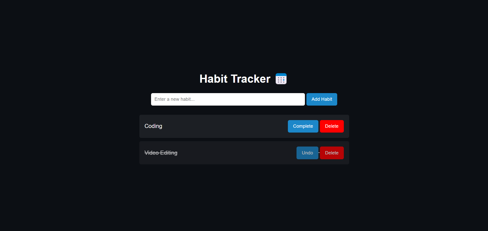

# Day 21: Habit Tracker 📅

## Project Overview
This project is a **Habit Tracker**, allowing users to list their habits, mark them as complete, and track their progress over time. It stores the habits in the browser's local storage, so even if the page is reloaded, the habits will remain.

### Features
- Add habits with a custom name.
- Mark habits as completed or undo them.
- Delete habits.
- Automatically saves habits using localStorage, keeping the data even after a page reload.
- Clean and simple user interface.

### How It Works
- **Add a habit:** Enter a habit in the input box and press the "Add Habit" button.
- **Complete a habit:** Click the "Complete" button next to a habit to mark it as done.
- **Undo a habit:** If you marked a habit by mistake, you can undo it by pressing the "Undo" button.
- **Delete a habit:** Press the "Delete" button to remove a habit completely.

### Demo
Check out the demo [here](https://30dayjs-vaibhavkatariya.vercel.app/Day-21).

