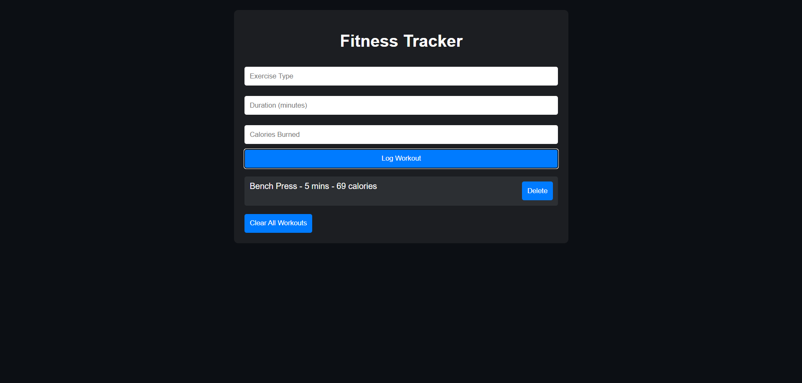

# Day 22: Fitness Tracker 🏋️‍♂️ 

## Project Overview
Today's project is a **Fitness Tracker** app, which helps users monitor their fitness activities by logging workouts, tracking progress, and maintaining an exercise history.

## Features
- Log workout sessions with details like exercise type, duration, and calories burned.
- View the history of logged workouts.
- Delete past workout entries.
- Basic data validation to ensure valid input.
- Clear button to reset the logged workouts.

## How It Works
- Enter your exercise type, duration, and calories burned, then click **Log Workout** to add it to your history.
- View all logged workouts below the form, with options to delete individual entries.
- Use the **Clear All Workouts** button to reset the entire workout history.

## Demo
Check out the demo [here](https://30dayjs-vaibhavkatariya.vercel.app/Day-22).

