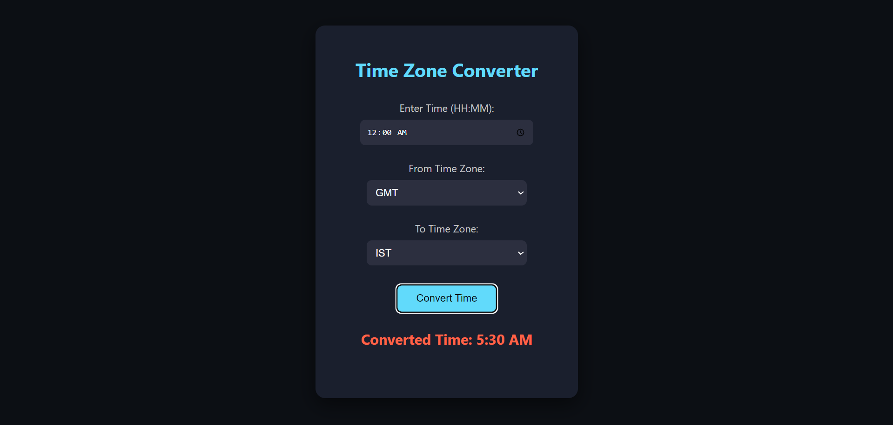

# Day 23: Time Zone Converter 🌍

## Project Overview
Today's project is a **Time Zone Converter** that allows users to input a time in one time zone and convert it to another time zone. The app supports multiple time zones including EST, PST, IST, GMT, and more.

## Features
- Convert time between different time zones.
- Supports common time zones such as EST, PST, IST, GMT, and CET.
- Handles both 24-hour and 12-hour formats with AM/PM conversion.
- Input validation for valid times.
- Simple user interface with time zone dropdowns and conversion button.

## How It Works
- Enter a time in the format `HH:MM` (e.g., `10:30`).
- Select the "From" and "To" time zones from the dropdown.
- Click **Convert** to get the converted time, which will be displayed in the output.

## Demo
Check out the demo [here](https://30dayjs-vaibhavkatariya.vercel.app/Day-23).

