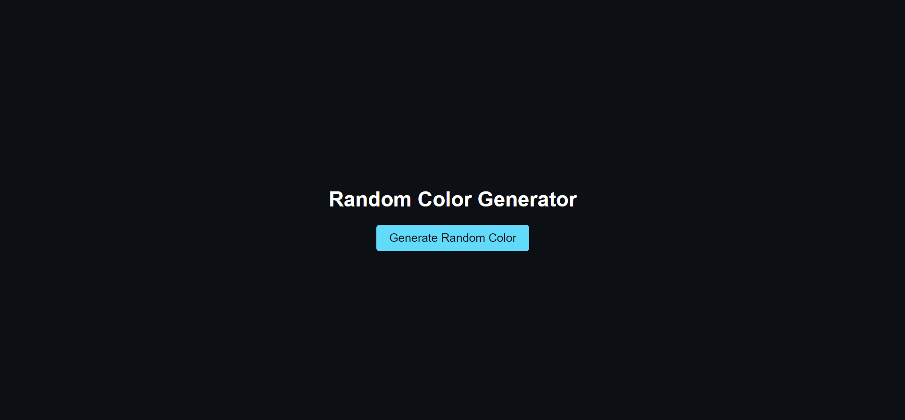

# Day 5: Random Color Generator 🎨

## Project Overview

The **Random Color Generator** allows users to change the background color of the webpage to a randomly generated color with the click of a button. It's a fun and quick project to explore JavaScript functions and DOM manipulation.

## Features

- Generate a random hex color.
- Change the background color on button click.

## Demo

Check out the live demo [here](https://30dayjs-vaibhavkatariya.vercel.app/Day-5).

