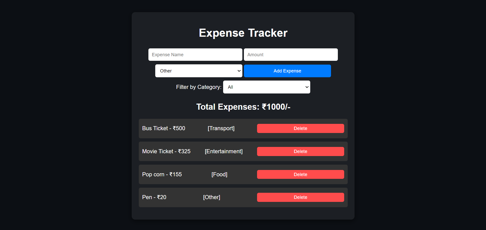

# Day 7: Expense Tracker App 💸

## Project Overview

Today's project is an **Expense Tracker App**. This app allows users to add, filter, and delete expenses while keeping track of the total amount spent. It demonstrates more complex JavaScript logic, including array manipulation, event handling, and local storage.

## Features

- **Add Expenses:** Add new expenses with name, amount, and category.
- **Track Total Expenses:** Displays the total amount of all expenses.
- **Filter Expenses:** Filter expenses based on categories like Food, Transport, etc.
- **Delete Expenses:** Remove specific expenses from the list.
- **Persistent Data:** Expenses are saved in local storage to retain data on page reload.

## How to Use

1. Enter an expense name, amount, and select a category.
2. Click "Add Expense" to add it to the list.
3. Use the "Filter by Category" dropdown to filter expenses.
4. Click the "Delete" button next to an expense to remove it.

## Demo

Check out the live demo [here](https://30dayjs-vaibhavkatariya.vercel.app/Day-7).

